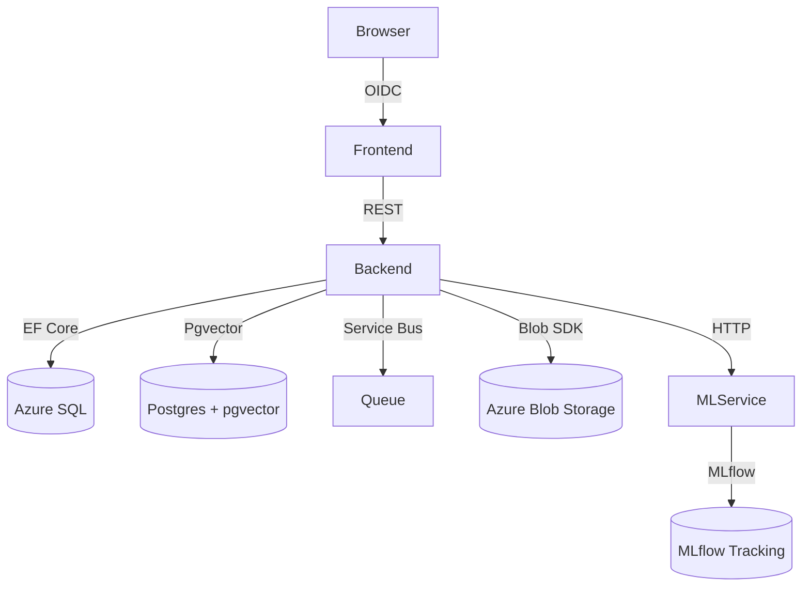

# Architecture Overview

```mermaid
graph TD
    Browser -->|OIDC| Frontend
    Frontend -->|REST| Backend
    Backend -->|EF Core| SQL[(Azure SQL)]
    Backend -->|Pgvector| VectorDB[(Postgres + pgvector)]
    Backend -->|Service Bus| Queue
    Backend -->|Blob SDK| Blob[(Azure Blob Storage)]
    Backend -->|HTTP| MLService
    MLService -->|MLflow| MLflow[(MLflow Tracking)]
```
